1 .git config --global user.name "Your Name"
  Sets the username that will be attached to your commits globally.
  example:git config --global user.name "Vivek"

2. git config --global user.email

Syntax

git config --global user.email "youremail@example.com"

Purpose

Sets the email address that will be associated with your commits.

Example

git config --global user.email "vivek@example.com"
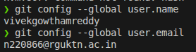

---git config --list

Syntax

git config --list

Purpose

Displays all the Git configuration settings currently active.

Example

git config --list
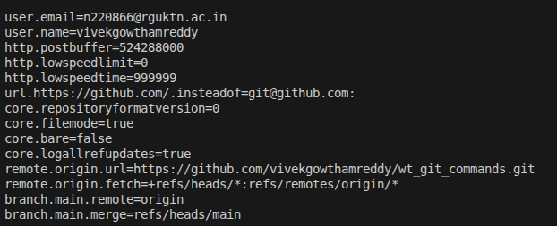

4. git config --unset

Syntax

git config --unset user.name

Purpose

Removes a Git configuration setting.

Example

git config --unset user.name

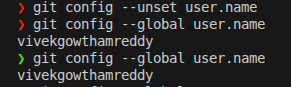

2. Repository Setup Commands

5. git init

Syntax

git init

Purpose

Initializes a new Git repository in the current directory.

Example

git init project
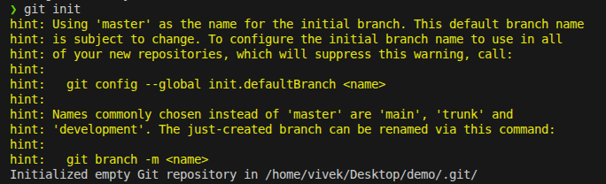

6. git clone

Syntax

git clone <repository-url>

Purpose

Creates a copy of an existing repository from a remote server.

Example

git clone https://github.com/user/project.git
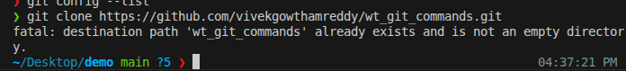

7. git clone --branch

Syntax

git clone --branch <branch-name> <repository-url>

Purpose

Clones a specific branch from a repository.

Example

git clone --branch main https://github.com/user/project.git
screen shot
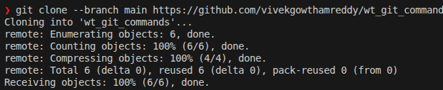

8. git clone --depth

Syntax

git clone --depth 1 <repository-url>

Purpose

Creates a shallow clone with limited commit history.

Example

git clone --depth 1 https://github.com/user/project.git

Screenshot Proof 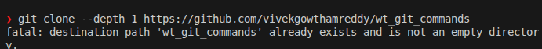

3. Repository Status & Inspection
9. git status

Syntax

git status

Purpose

Shows the current state of the working directory and staging area.

Example

git status 

Screenshot Proof  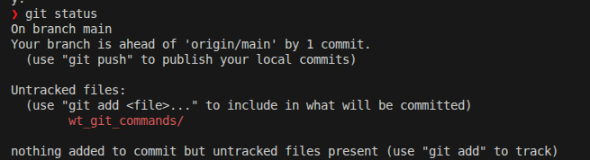

10. git log

Syntax

git log

Purpose

Displays the commit history of the repository.

Example

git log

Screenshot Proof : 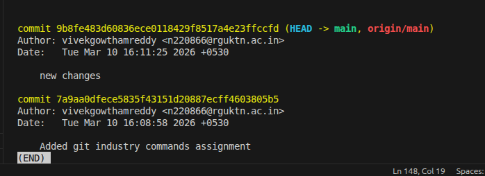

11. git log --oneline

Syntax

git log --oneline

Purpose

Displays commit history in a compact single-line format.

Example

git log --oneline

Screenshot Proof 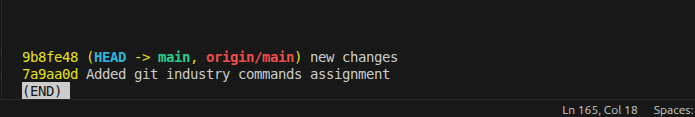

12. git log --graph

Syntax

git log --graph

Purpose

Shows commit history along with a graphical representation of branches and merges.

Example

git log --graph

Screenshot Proof 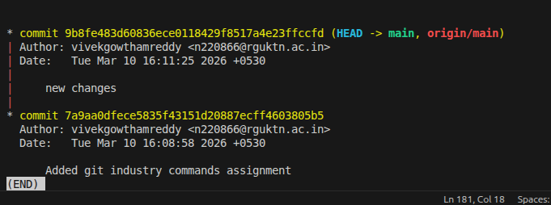

git show

Syntax

git show <commit-id>

Purpose

Displays detailed information about a specific commit.

Example

git show a1b2c3d

Screenshot Proof 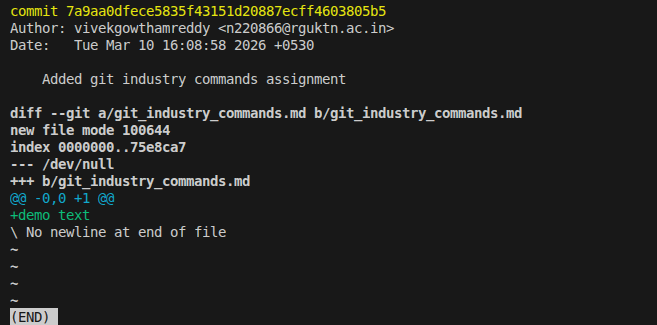

14. git diff

Syntax

git diff

Purpose

Shows differences between working directory and staging area.

Example

git diff

Screenshot Proof : 

15. git diff --staged

Syntax

git diff --staged

Purpose

Displays changes that are staged for the next commit.

Example

git diff --staged

Screenshot Proof 

16. git blame

Syntax

git blame <file-name>

Purpose

Shows who modified each line of a file and when.

Example

git blame index.html

Screenshot Proof 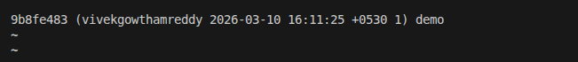

17. git reflog

Syntax

git reflog

Purpose

Displays a log of all actions performed on the HEAD reference including commits, resets, and checkouts. It helps recover lost commits.

Example

git reflog

screenshot: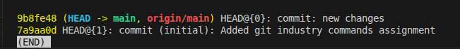

18. git shortlog

Syntax

git shortlog

Purpose

Summarizes the commit history grouped by author.

Example

git shortlog

Screenshot Proof: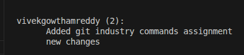

4. File Tracking Commands
19. git add

Syntax

git add <file-name>

Purpose

Adds a specific file to the staging area.

Example

git add index.html

screenshot: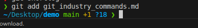
